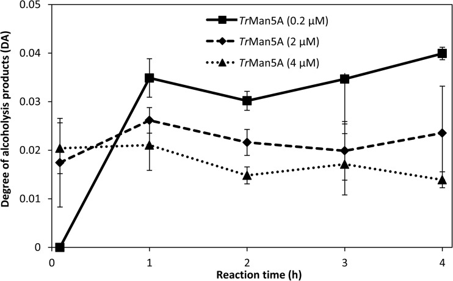
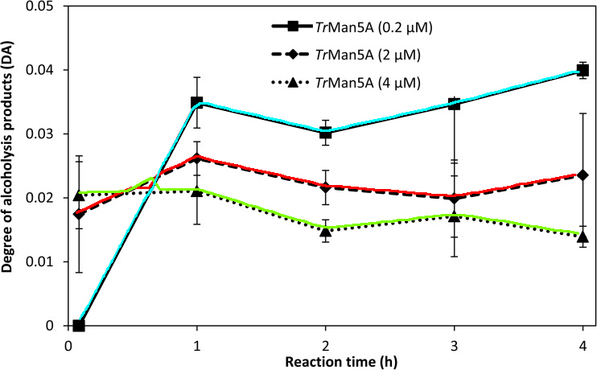

# LineFormer - Rethinking Chart Data Extraction as Instance Segmentation

Official repository for the ICDAR 2023 Paper

[<u>[Link]</u>](https://arxiv.org/abs/2305.01837) to the paper.

## Quantitative Results
| Dataset             | AdobeSynth19 Visual Element Detection[^1] | Data Extraction[^2] | UB-PMC22 Visual Element Detection | Data Extraction | LineEX Visual Element Detection | Data Extraction |
|---------------------|------------------------------------------|---------------------|----------------------------------|-----------------|---------------------------------|----------------|
| ChartOCR[^3]        | 84.67                                    | 55                  | 83.89                            | 72.9            | 86.47                           | 78.25          |
| Lenovo[^4]          | **99.29**                                | **98.81**          | 84.03                            | 67.01           | -                               | -              |
| LineEX[^5]          | 82.52                                    | 81.97               | 50.23[^6]                         | 47.03           | 71.13                           | 71.08          |
| **Lineformer** (Ours)   | 97.51                                    | 97.02               | **93.1**                          | **88.25**       | **99.20**                       | **97.57**      |

[^1]: [task-6a from CHART-Info challenge](https://example.com/chart-info-task-6a)
[^2]: [task-6b data score from CHART-Info challenge](https://example.com/chart-info-task-6b)
[^3]: [ChartOCR~\cite{luo_chartocr_2021}](https://openaccess.thecvf.com/content/WACV2021/papers/Luo_ChartOCR_Data_Extraction_From_Charts_Images_via_a_Deep_Hybrid_WACV_2021_paper.pdf)
[^4]: [Lenovo~\cite{ma_towards_2021}](https://link.springer.com/chapter/10.1007/978-3-030-86549-8_37)
[^5]: [LineEX~\cite{p_lineex_2023}](https://openaccess.thecvf.com/content/WACV2023/papers/P._LineEX_Data_Extraction_From_Scientific_Line_Charts_WACV_2023_paper.pdf)
[^6]: Ignoring samples without legend, as LineEX doesn't support them

<!-- **If you would like to cite our work:**
```latex

``` -->

## Model Usage
### Install Environment

This code is based on [MMdetection Framework](https://github.com/open-mmlab/mmdetection) The following is brief environment and installation:

Code has been tested on Pytorch 1.13.1 and CUDA 11.7.

Create Conda Environment and install dependencies:
```bash
conda create -n LineFormer python=3.8
conda activate LineFormer
bash install.sh
```


### Inference

1. Download the Trained Model Checkpoint [here](https://drive.google.com/drive/folders/1K_zLZwgoUIAJtfjwfCU5Nv33k17R0O5T?usp=sharing)
2. Verify the Path to Pretrained Checkpoint in `lineformer_swin_t_config.py` and `infer.py`
3. Use the demo inference snippet shown below

```python
import infer
import cv2
import line_utils

img_path = "demo/PMC5959982___3_HTML.jpg"
img = cv2.imread(img_path) # BGR format

CKPT = "iter_3000.pth"
CONFIG = "lineformer_swin_t_config.py"
DEVICE = "cpu"

infer.load_model(CONFIG, CKPT, DEVICE)
line_dataseries = infer.get_dataseries(img, to_clean=False)

# Visualize extracted line keypoints
img = line_utils.draw_lines(img, line_utils.points_to_array(line_dataseries))
    
cv2.imwrite('demo/sample_result.png', img)


```

Example extraction result:




Note: LineFormer returns data in form of x,y points w.r.t the image, to extract full data-values you need to extract axis information, which can be done using [this](https://github.com/pengyu965/ChartDete/) repo.
